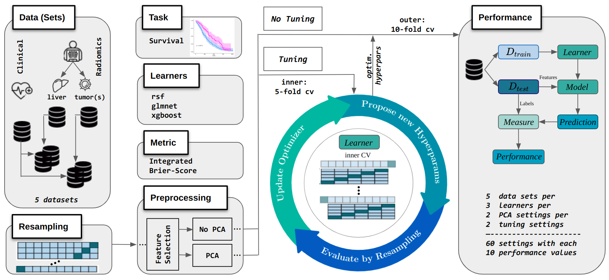

# benchmarkRadiomics

We provide a benchmark framework for radiomics-based survival analysis, aimed at identifying the optimal settings with respect to different radiomics data sources and various ML pipeline variations, including preprocessing techniques and learning algorithms.

*Keywords*: radiomics, CT imaging data, colorectal cancer, survival, machine learning, benchmark, mlr3.

Our goal is to provide an mostly automated approach for conducting and evaluating benchmark studies that compare various pipelines for radiomics analyses. This includes the following steps:

1. [Calculation of radiomics features](#calculation-of-radiomics-features)
2. [Radiomics-based benchmark experiment](#radiomics-based-benchmark-experiment)
3. [Evaluation of the benchmark results via an LMM](#evaluation-of-the-benchmark-results-via-an-lmm)

We conducted the aforementioned analysis steps for our original study; however, due to data privacy laws, we are unable to present the study with the original radiomics data. Instead, we provide the analysis using an example dataset. For the final step, where the benchmark results are analyzed using a mixed model approach, we present our own results. Accordingly, all three analysis steps are to be considered disjoint here.

## Calculation of radiomics features

[PyRadiomics](https://pyradiomics.readthedocs.io/en/latest/) is a [Python package](https://github.com/AIM-Harvard/pyradiomics) that can be used to calculate radiomics features. It includes a command-line script that can be used for both single image extraction and batch processing. For our use case we adapted the example [batchprocessing script](https://github.com/AIM-Harvard/pyradiomics/blob/master/examples/batchprocessing.py). This script can also be found in `example_radiomcsCalc.py`.

## Radiomics-based benchmark experiment

Our benchmark was set up as described in the figure below, but it can be easily adapted for regression or classification tasks, including the comparison of different learners with appropriate hyperparameters, utilization of alternative metrics, customization of the preprocessing steps, etc.

We present the benchmark experiment in `2_radiomicsBenchmark.R` for the example dataset of the [Shedden Lung Cancer Study](https://www.openml.org/search?type=data&status=any&id=1245) provided in *OpenML*. 
Adaptations made in comparison to the original study are documented in the comments within the R script.

## Evaluation of the benchmark results via an LMM

In the meta-analysis of the benchmark results, a linear mixed model (LMM) was employed to examine significant differences among the observed performances. The LMM accounted for data correlation induced by repeatedly using the same cross-validation train/test sets by incorporating a random effect. To enable inference with respect to the experimental benchmark setup of our original study, we included datasets and pipeline variations, along with their interactions, as fixed effects in the LMM and analyzed their relevance via analysis of variance (ANOVA). Of course the composition of fixed effects is dependent on the benchmark setup chosen.

 and ▍= simultaneous confidence intervals (CIs) of the linear mixed model (LMM). This LMM models the IBS of the benchmark results via the predictors dataset and pipeline configuration, and their interaction, along with the training/test CV fold as random effect.")
